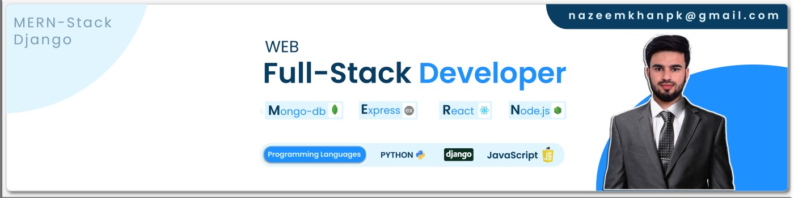

<h1>Hi 👋, I'm Nazeem Khan</h1>

A Passionate Full Stack Developer  | AI Enthusiast | Next.js & MERN Expert

<!-- about me -->
# 💫 About Me:
 Hi there! 👋    - 🔭 I’m currently working on Full Stack Web Development & AI-Powered meal Planner Platform   - 🌱 I’m learning Scalable Architectures, AI Integration & Cloud computing  - 🤝 I’m looking to collaborate on MERN, Next.js, and AI-driven applications   - 💬 Ask me about JavaScript, TypeScript, React, Node.js, Rest APIs, and AI in Web Development  - 📫 How to reach me: nazeemkhanpk@gmail.com 😊  

## 🌐 Socials:
       

# 💻 Tech Stack:
                                
# 📊 GitHub Stats:
 
 

## 🏆 GitHub Trophies

### ✍️ Random Dev Quote

### 🔝 Top Contributed Repo

---

<!-- Proudly created with GPRM ( https://gprm.itsvg.in ) -->

<!-- tophies -->
<!-- 

 -->

<!-- snake game path -->
<picture>
  <source media="(prefers-color-scheme: dark)" srcset="https://raw.githubusercontent.com/tobiasmeyhoefer/tobiasmeyhoefer/output/github-snake-dark.svg" />
  <source media="(prefers-color-scheme: light)" srcset="https://raw.githubusercontent.com/tobiasmeyhoefer/tobiasmeyhoefer/output/github-snake.svg" />
  
</picture>